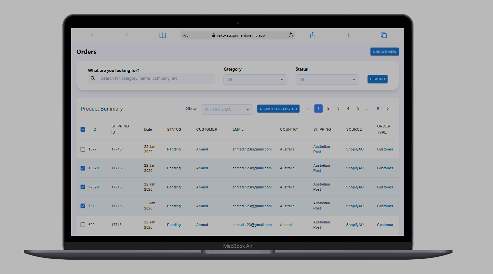
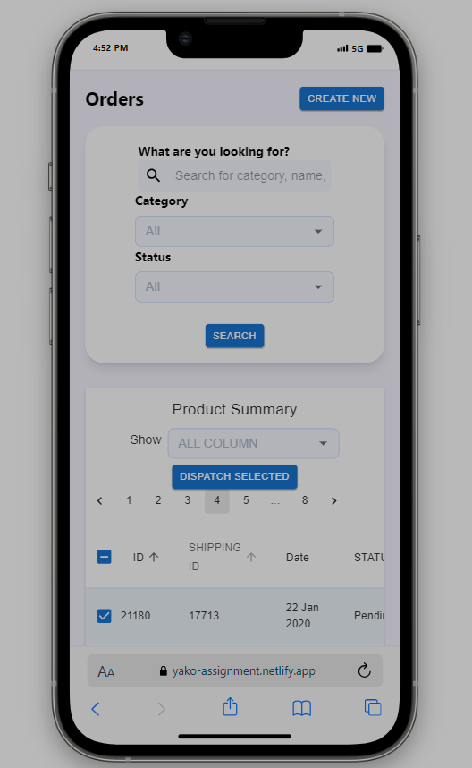
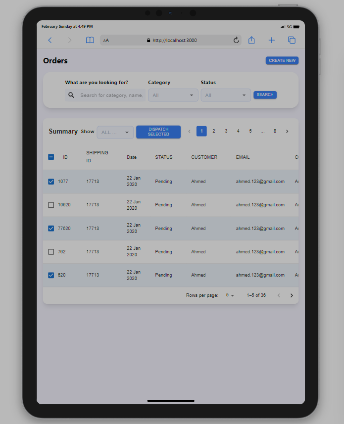

# Project Documentation

## Overview
This project is a comprehensive web application built using **React**, a popular JavaScript library for building user interfaces, and **Next.js**, a framework that enables features such as server-side rendering and generating static websites for React based web applications. The project is configured with **ESLint**, a tool for identifying and reporting on patterns found in ECMAScript/JavaScript code, **PostCSS**, a tool for transforming CSS with JavaScript, and **Tailwind CSS**, a utility-first CSS framework for rapidly building custom designs.

## Snapshots

 

  
  

## Features
### Product Summary
The ProductSummary component, located in <a href = "src/components/productSummary.jsx"> src/components/productSummary.jsx </a>, is a key feature of this application. It displays a table of product data, providing an overview of all the products in a structured and readable format. The table is not just a static display but includes interactive features such as pagination and sorting.

### Pagination
Pagination is a technique of distributing the data across multiple pages, with a set number of rows per page. This is particularly useful when dealing with large data sets, as it allows users to navigate through the data in a more manageable way. In this application, the pagination feature is built into the product summary table, allowing users to control the number of rows they want to view at a time and navigate between pages easily.

### Sorting
Sorting is another powerful feature of the product summary table. It allows users to order the data in a way that makes sense for them. By clicking on the column headers, users can sort the table data based on that column in ascending or descending order. This feature enhances the user experience by providing a quick and easy way to organize and analyze the data.

### Responsiveness
Responsiveness is a critical aspect of modern web design. A responsive design ensures that the application looks good and works well on all devices, from mobile phones to desktop computers. In this application, the product summary table is designed to be responsive. It adjusts its layout and functionality based on the screen size of the device, providing an optimal user experience on any device.

### Top Bar
The TopBar component, located in <a href="src/components/topBar.jsx">src/components/topBar.jsx </a>, is a navigation component that appears at the top of the application. It provides quick access to different sections of the application, enhancing the overall navigability and user experience.

### Custom Dropdown
The CustomDropdown component, located in <a href="src/utils/customDropdown.jsx">src/utils/customDropdown.jsx </a>, is a reusable component that renders a dropdown menu. This component can be used throughout the application wherever a dropdown menu is needed. The options for the dropdown menus are defined in <a href="src/data/dropdownOptions.js">src/data/dropdownOptions.js </a>, making it easy to manage and update the dropdown options centrally.

### Form Container
The FormContainer component, located in <a href="src/utils/formContainer.jsx">src/utils/formContainer.jsx </a>, is a utility component that provides a container for form elements. This component helps to ensure consistency in the design and layout of forms throughout the application.

### Search Input
The Search component, located in <a href="src/utils/searchInput.jsx">src/utils/searchInput.jsx </a>, is a utility component that renders a search input field. This component can be used throughout the application to provide a consistent and user-friendly search functionality.

## Setup and Running
1. To set up the project, run **npm install** to install dependencies.
2. Start the development server with **npm run dev**.
3. Build the project for production using **npm run build**.

## Linting
The project uses ESLint for linting. The ESLint configuration is defined in .eslintrc.json. Linting is an important part of any development process, as it helps to catch errors and maintain a consistent coding style. To run the linter, use npm run lint.

## Styling
The project uses Tailwind CSS for utility-first CSS styling. The Tailwind configuration is defined in **tailwind.config.js**. This approach to styling makes it easy to build custom designs without leaving your HTML. The project also uses PostCSS for processing CSS. The PostCSS configuration is defined in **postcss.config.js**. PostCSS is a tool for transforming CSS with JavaScript, and it provides many features that make working with CSS more powerful and flexible.

## Next.js Configuration
The Next.js configuration is defined in **next.config.mjs**. This file is where you can customize the behavior of Next.js. This includes settings for things like custom webpack configuration, modifying the Babel configuration, and specifying custom server routes.

## Pages
The pages of the application are defined in the <a href="src/pages">src/pages </a> directory. This includes the main index page (src/pages/index.js), the custom _app.js and _document.js files, and any API routes. The _app.js file is used to initialize pages. It allows you to override the default App component provided by Next.js. The _document.js file is used to augment the application's <html> and <body> tags. API routes provide a solution to build your API with serverless functions, which are a piece of code written in server-side languages that live on the cloud, and they're a way to run server-side code without having to manage a server.
